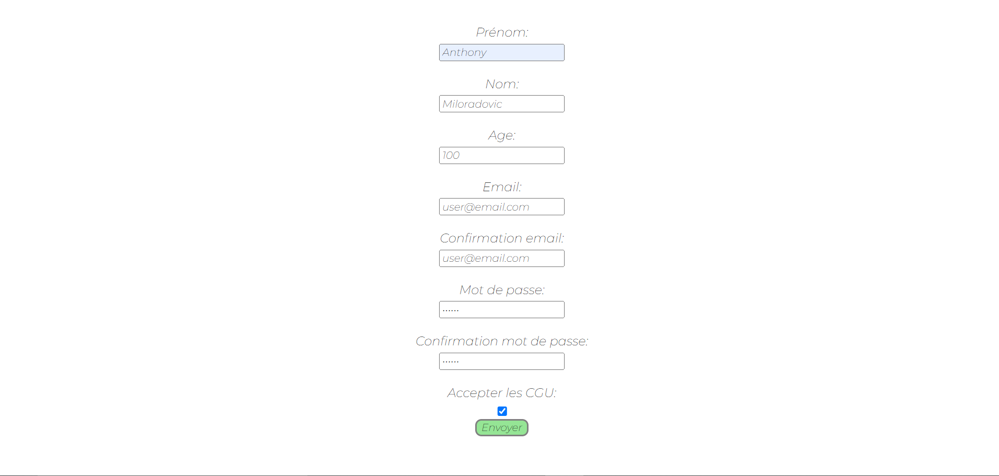

## Petit exercice Javascript 
 
- L'indémodable vérificateur de formulaire   

Formulaire d'inscription, lors du submit, celui-ci vérifiera la validité de chacun des champs. Si un ou plusieurs des champs sont mauvais, le formulaire ne sera pas envoyé, et une alerte s'affichera

    

Une fois que tous les champs sont bons, alors l'utilisateur est renvoyé sur une page lui indiquant qu'il a tout bien rempli. 

  

 Ciao 	&#129302;

